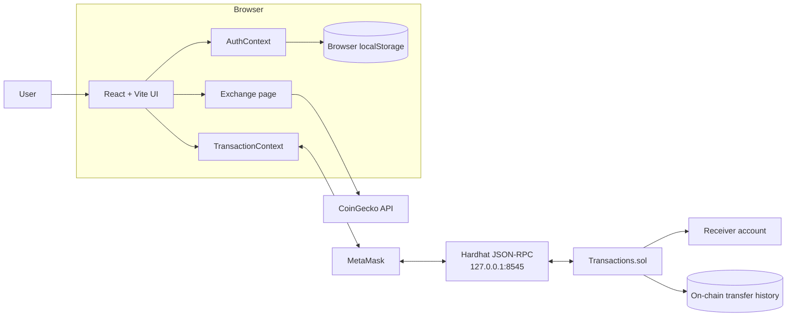
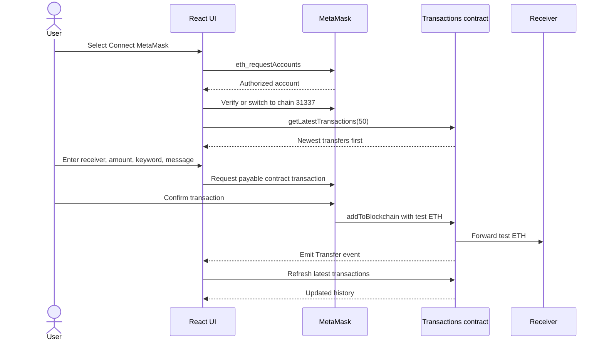

<p align="center">
  
</p>

<h1 align="center">Cognitensor Ethereum Decentralized App</h1>

<p align="center">
  A local-first Ethereum dApp for sending test ETH through MetaMask and viewing recent on-chain transfers.
</p>

<p align="center">
  
  
  
  
  
</p>

> [!WARNING]
> This project is intentionally restricted to **Hardhat Localhost (chain ID 31337)**. Hardhat accounts use public, well-known private keys. Never send real ETH or other real assets to these accounts, and never reuse their keys on a live network.

## Table of contents

- [Overview](#overview)
- [Features](#features)
- [Architecture](#architecture)
- [Transaction flow](#transaction-flow)
- [Technology stack](#technology-stack)
- [Prerequisites](#prerequisites)
- [Quick start](#quick-start)
- [Connect MetaMask](#connect-metamask)
- [Manual startup](#manual-startup)
- [Smart contract](#smart-contract)
- [Project structure](#project-structure)
- [Commands](#commands)
- [Configuration](#configuration)
- [Testing](#testing)
- [Security model](#security-model)
- [Troubleshooting](#troubleshooting)
- [Production considerations](#production-considerations)

## Overview

Cognitensor combines a React frontend, MetaMask, a local Hardhat blockchain, and a Solidity smart contract. A transfer is completed atomically: the contract receives test ETH, forwards it to the selected receiver, records the transfer, and emits a `Transfer` event in the same blockchain transaction.

The frontend restores a previously authorized MetaMask account, verifies the active chain, displays up to 50 recent contract transfers, and refreshes history after confirmed transfers, contract events, account changes, network changes, and periodic polling.

The application also includes responsive login and signup screens and an ETH-to-fiat conversion page. Authentication data is stored only in the current browser for demonstration purposes.

## Features

- MetaMask connection with automatic restoration of previously approved accounts
- Local network add/switch prompt for Hardhat chain ID `31337`
- Strict frontend and deployment checks that reject other networks
- Atomic ETH transfer and on-chain transaction recording
- Newest-first transaction history with a 50-record frontend limit
- Automatic refresh from contract events and 15-second polling
- Account and network change handling without a page reload
- Responsive wallet card, navigation, forms, and transaction grid
- Client-side demo signup and login
- Live ETH conversion rates from CoinGecko
- One-command local chain, contract deployment, and frontend startup
- Automatic frontend ABI and contract-address generation after deployment

## Architecture



### Component responsibilities

| Component | Responsibility |
| --- | --- |
| React UI | Wallet controls, transfer form, transaction cards, authentication, and exchange-rate views |
| `TransactionContext` | MetaMask connection, network validation, transfers, history loading, and wallet event handling |
| MetaMask | Account authorization, transaction approval, signing, and network management |
| Hardhat | Local chain, funded development accounts, JSON-RPC endpoint, and contract execution |
| `Transactions.sol` | Atomically forwards ETH, stores transfer metadata, and emits `Transfer` events |
| Deployment script | Deploys only to chain `31337` and writes the ABI/address into the frontend |
| `AuthContext` | Stores salted password hashes and the active demo session in browser `localStorage` |

## Transaction flow



## Technology stack

| Layer | Technology |
| --- | --- |
| Frontend | React 17, React Router 6, Vite 2 |
| Styling | Tailwind CSS 2, PostCSS, custom responsive CSS |
| Wallet integration | MetaMask EIP-1193 provider |
| Ethereum library | ethers.js 5 |
| Smart contracts | Solidity 0.8 |
| Local blockchain | Hardhat 2 |
| Contract testing | Mocha, Chai, Waffle |
| Exchange rates | CoinGecko public API |
| Demo authentication | Web Crypto API and browser `localStorage` |

## Prerequisites

Install the following before starting:

- [Node.js](https://nodejs.org/) and npm
- [MetaMask](https://metamask.io/) in a supported browser
- Bash and `curl` for the one-command startup script
- Git if cloning from GitHub

On Windows, use WSL or Git Bash for `npm run dev:local`. The manual startup commands also work from separate compatible terminals.

## Quick start

Clone the repository:

```bash
git clone https://github.com/SiddheshRaje/EthereumDecentralizedApp.git
cd EthereumDecentralizedApp
```

Install frontend and smart-contract dependencies:

```bash
npm run setup
```

Start the local blockchain, deploy a fresh contract, and launch the frontend:

```bash
npm run dev:local
```

Open:

```text
http://localhost:3000
```

Keep the terminal running while using the dApp. The startup script:

1. Reuses an existing Hardhat node on `127.0.0.1:8545` or starts one.
2. Verifies chain ID `31337`.
3. Deploys a fresh `Transactions` contract.
4. Writes the new address to `application/src/utils/deployment.json`.
5. Writes the matching ABI to `application/src/utils/Transactions.json`.
6. Starts the Vite development server.

## Connect MetaMask

1. Open the application and select **Connect MetaMask**.
2. Approve the account connection.
3. Approve adding or switching to **Hardhat Localhost**.
4. If needed, import a funded Hardhat development account:
   - When `npm run dev:local` starts the node, account details are written to `smart_contract/hardhat-node.log`.
   - When `npm run chain` starts the node, account details appear in that terminal.
5. Use only the local test ETH supplied by Hardhat.

### Hardhat Localhost settings

| Setting | Value |
| --- | --- |
| Network name | Hardhat Localhost |
| RPC URL | `http://127.0.0.1:8545` |
| Chain ID | `31337` |
| Currency symbol | ETH |

MetaMask requires user approval on the first connection. A website cannot approve wallet access automatically. After approval, Cognitensor uses `eth_accounts` to restore the account on later visits without opening another connection prompt.

## Manual startup

Use three terminals if you prefer to control each process separately.

### 1. Start the blockchain

```bash
npm run chain
```

### 2. Deploy the contract

```bash
npm run deploy:local
```

### 3. Start the frontend

```bash
npm run app
```

Restarting the Hardhat node creates a new blockchain and removes the previous local transaction history. Deploy the contract again after every restart.

## Smart contract

The `Transactions` contract is located at `smart_contract/contracts/Transactions.sol`.

### Public interface

| Function | Purpose |
| --- | --- |
| `addToBlockchain(receiver, message, keyword)` | Payable function that records and forwards `msg.value` atomically |
| `getLatestTransactions(limit)` | Returns up to `limit` transfers in newest-first order |
| `getAllTransactions()` | Returns the complete local transfer history |
| `getTransactionCount()` | Returns the total number of recorded transfers |

### Recorded transfer data

Each transfer stores:

- Sender address
- Receiver address
- Amount in wei
- Message
- Block timestamp
- Keyword

The contract rejects zero-value transfers and the zero receiver address. If forwarding ETH fails, the entire transaction reverts, including the history update.

## Project structure

```text
EthereumDecentralizedApp/
├── application/                     # React and Vite frontend
│   ├── images/                      # Cognitensor brand assets
│   ├── src/
│   │   ├── components/              # Navbar, wallet, transfer history, footer
│   │   ├── context/                 # Wallet/transaction and demo auth state
│   │   ├── pages/                   # Login, signup, and exchange routes
│   │   ├── utils/
│   │   │   ├── deployment.json      # Generated local address/network data
│   │   │   └── Transactions.json    # Generated contract ABI
│   │   ├── App.jsx                  # Application routes
│   │   ├── favicon.svg              # Cognitensor favicon
│   │   └── main.jsx                 # React entry point
│   ├── package.json
│   └── vite.config.js
├── smart_contract/                  # Hardhat workspace
│   ├── contracts/Transactions.sol
│   ├── scripts/deploy.js
│   ├── test/transactions-test.js
│   ├── hardhat.config.js
│   └── package.json
├── scripts/dev-local.sh             # Complete local startup workflow
├── package.json                     # Root commands
└── README.md
```

Generated directories such as `node_modules`, `dist`, Hardhat `artifacts`, and `cache` are excluded from Git.

## Commands

Run these commands from the repository root:

| Command | Description |
| --- | --- |
| `npm run setup` | Install smart-contract and frontend dependencies |
| `npm run dev:local` | Start/reuse Hardhat, deploy the contract, and run Vite |
| `npm run chain` | Start only the Hardhat JSON-RPC node |
| `npm run deploy:local` | Deploy to the running local node and update frontend files |
| `npm run app` | Start only the Vite frontend |
| `npm test` | Run contract tests, then build the frontend |

Additional workspace commands:

```bash
npm test --prefix smart_contract
npm run compile --prefix smart_contract
npm run build --prefix application
npm run serve --prefix application
```

## Configuration

Normal local development requires no private keys or environment variables.

The deployment script generates:

```json
{
  "address": "0x...",
  "chainId": 31337,
  "network": "Hardhat Localhost"
}
```

Advanced frontend overrides can be placed in `application/.env.local`:

```dotenv
VITE_RPC_URL=http://127.0.0.1:8545
VITE_CHAIN_ID=31337
VITE_CONTRACT_ADDRESS=0xYourLocalContractAddress
```

The generated deployment values are preferred for normal use. Do not commit `.env` or `.env.local` files containing secrets.

## Testing

Run the complete validation:

```bash
npm test
```

This command currently verifies:

- ETH is forwarded and recorded atomically
- Newest-first history and limits work correctly
- Zero-value transfers are rejected
- Zero-address receivers are rejected
- The React application produces a successful production build

Run frontend linting directly:

```bash
cd application
npx eslint src
```

## Security model

### Network protection

- Hardhat is configured only for `hardhat` and `localhost`.
- The deployment script refuses any chain other than `31337`.
- The frontend disables transfers until MetaMask reports chain `31337`.
- The contract address and ABI are generated from the current local deployment.

### Development accounts

Hardhat prints this warning when it starts:

> Any funds sent to them on Mainnet or any other live network WILL BE LOST.

This is expected. The displayed accounts and private keys are public test credentials. They are safe only for disposable local development.

### Demo authentication

Signup and login are browser-local demonstrations. Passwords are salted and hashed with the Web Crypto API, but the user database and session remain in `localStorage`. This is not suitable for production authentication, shared accounts, password recovery, or sensitive user data.

## Troubleshooting

### MetaMask is not detected

Install or enable MetaMask, allow it for the current site, and reload the page.

### The app says “Local network required”

Select the network-switch button and approve the request in MetaMask. Confirm that the Hardhat node is running at `http://127.0.0.1:8545`.

### “No transaction contract was found”

The local node probably restarted, which erased the old deployment. Run:

```bash
npm run deploy:local
```

Then reload the application. Using `npm run dev:local` handles this automatically.

### Port 8545 is already in use

The startup script reuses an existing endpoint only when it reports Hardhat chain ID `31337`. Stop any other Ethereum node using port `8545`, then rerun the command.

### Port 3000 is already in use

Stop the other frontend process. Vite may otherwise select another available port; use the URL printed in the terminal.

### MetaMask shows stale nonce or activity after restarting Hardhat

The blockchain state was reset while MetaMask retained local activity. Clear the account activity from MetaMask’s advanced settings or remove and re-add the local network, then reconnect.

### No transactions are displayed

Confirm that:

- MetaMask is connected.
- Chain ID `31337` is active.
- The current contract has been deployed.
- At least one transfer has been confirmed on the current Hardhat node.

## Production considerations

This repository is configured as a local demonstration and deliberately blocks live networks. A production release requires a separate reviewed deployment plan, including:

- A supported live or public test network configuration
- Secure deployment key management
- Contract security review and gas analysis
- A scalable transaction-indexing strategy
- Server-backed authentication
- Production RPC infrastructure
- Error monitoring and rate-limit handling
- Updated dependencies and continuous integration

Never remove the local-network safeguards and reuse Hardhat development keys for a public deployment.
